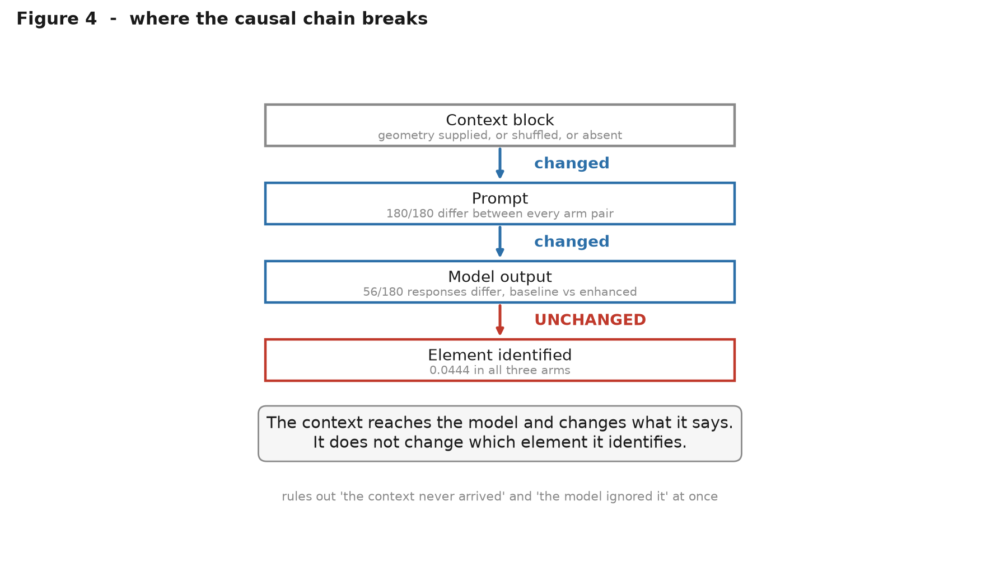
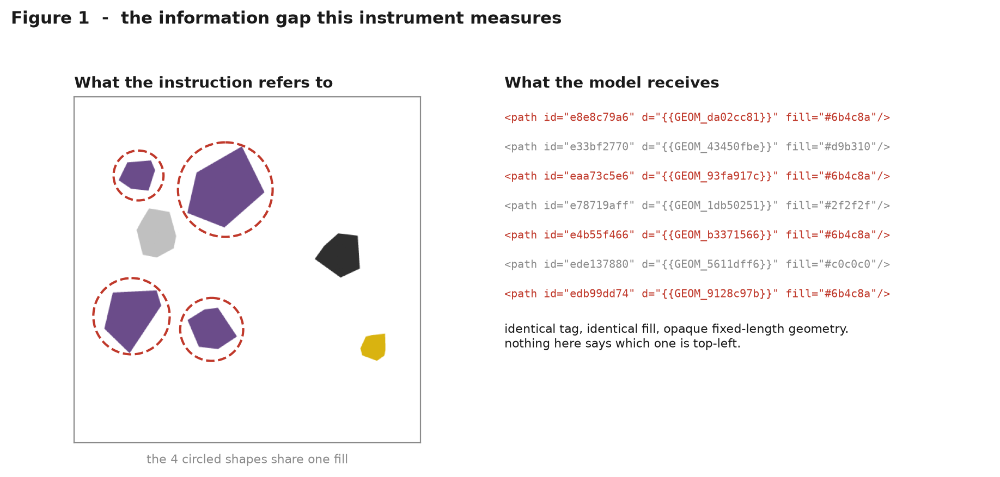

# svg-ambiguity-bench

**An evaluation methodology for context-augmentation experiments, demonstrated through a
pre-registered SVG reference-resolution study.**

When added context improves a model, was it the *information* or the *format*? Most
evaluations cannot tell. This one can, because it runs a third arm with the same format
and the information destroyed.

[](tests/)
[](pyproject.toml)
[](LICENSE)
[](DESIGN_FREEZE.md)
[](docs/04-results.md)
[](https://doi.org/10.5281/zenodo.21682240)



---

## TL;DR

- **Question.** Does context augmentation help because of the information it supplies, or
  merely the format it arrives in?
- **Method.** A third arm, format-identical to the augmented one, with the values
  permuted between elements. Same shape, wrong contents. → [`METHOD.md`](METHOD.md)
- **Result.** A **constrained null**: context changed what the model said (56/180
  responses) but not which element it identified (0.0444 in all three arms).

---

## Key result

`qwen2.5-coder:3b` · 180 cases per arm · 30 clusters · cluster bootstrap over SVGs

| arm | identification accuracy | `NO_EDIT` | malformed | abstained |
|---|---|---|---|---|
| `baseline` — no context | **0.0444** [0.0167, 0.0778] | 0.444 | 0 | 0 |
| `permuted` — same format, values shuffled | **0.0444** [0.0167, 0.0778] | 0.483 | 0 | 0 |
| `enhanced` — geometry supplied | **0.0444** [0.0167, 0.0778] | 0.478 | 0 | 0 |

Random-selection reference **0.1852** · every pairwise difference **+0.0000** ·
**minimum detectable effect 0.0289**

> Read the MDE, not the p-values. With a difference of exactly zero no permutation can be
> more extreme, so p = 1.000 by construction and carries no information. The claim is
> that **no effect larger than ~3 points occurred** — not that the effect is zero.

---

## Quick start

```bash
pip install -e ".[dev]"
python -m svgbench.cli report
```

Regenerates every published number from committed evaluation rows in ~2 seconds. **No
model, no renderer, no network.**

---

## The problem, in four lines of markup

You ask for *"make the top-left shape blue"*. The model sees:

```xml
<path id="e13415408" d="{{GEOM_1b7549de}}" fill="#8c5a3c"/>
<path id="e15485c60" d="{{GEOM_33cabe17}}" fill="#c0c0c0"/>
<path id="e0d63fea4" d="{{GEOM_c2532d12}}" fill="#8c5a3c"/>
<path id="e30176ca8" d="{{GEOM_a9f3024e}}" fill="#8c5a3c"/>
```

Three share a fill. Nothing says which is top-left. The instruction refers to the
*rendered picture*; the edit happens in the *source text*; the source text does not encode
what the instruction is about.



---

## Why the null is a result

Three hypotheses, all measured:

| | | |
|---|---|---|
| **H1** the model ignored the context | *rejected* | 56/180 responses differ |
| **H2** the context never reached the model | *rejected* | 180/180 prompts differ |
| **H3** context altered generation without improving reference resolution | **supported** | the only hypothesis consistent with both |

`permuted` and `enhanced` identified **exactly the same 8 cases**. Shuffling the geometry
between elements changed nothing about which element was acted on.

**On the central claim:** the treatment effect was zero, so there is no quantity to
decompose. C3 is **not supported because its prerequisite did not occur** — a scientific
dependency, not a methodological failure.

→ [`docs/04-results.md`](docs/04-results.md)

---

## Reproducing

| Tier | Verifies | Needs | Time |
|---|---|---|---|
| **1** | every published number | Python | ~2 s |
| **2** | the whole scoring chain, from raw responses | Python | ~10 s |
| **3** | the corpus is a deterministic function of its seed | + renderer | ~2 min |
| **4** | the model results | + local model | ~1 h |

```bash
python -m svgbench.cli report              # tier 1
python -m svgbench.cli evaluate            # tier 2
python -m svgbench.cli verify --determinism # tier 3
python -m svgbench.cli run main-baseline   # tier 4
```

540 raw model responses are committed, so a sceptical reader can write their own scorer
and check ours against it. Tier 4 will **not** reproduce bit-for-bit — local backends vary
with build and threading. What reproduces is the conclusion, within the reported interval.

---

## Navigating

**New here? → [`START_HERE.md`](START_HERE.md)** picks the right document for what you
want.

| | |
|---|---|
| [`METHOD.md`](METHOD.md) | **the transferable part** — format-matched controls, domain-independent |
| [`docs/essay.md`](docs/essay.md) | *How we almost measured the wrong thing* — the essay |
| [`docs/04-results.md`](docs/04-results.md) | full write-up |
| [`VALIDITY.md`](VALIDITY.md) | internal / construct / external / statistical validity |
| [`LIMITATIONS.md`](LIMITATIONS.md) | 17 things this does not show |
| [`CLAIMS.md`](CLAIMS.md) | every module maps to one claim, and what falsifies it |
| [`FAILED_ASSUMPTIONS.md`](FAILED_ASSUMPTIONS.md) | eleven times this project proved itself wrong |
| [`RESULTS.md`](RESULTS.md) | what may not change once results exist |
| [`docs/adr/`](docs/adr/) | eleven decision records |

---

## Provenance

The corpus, scoring rules, predicates and analysis plan were frozen at the
[`instrument-freeze-v1`](https://github.com/NITISH-R-G/svg-ambiguity-bench/releases/tag/instrument-freeze-v1)
tag, before any model output was observed.

That claim arrives in three layers, and they are **not** equally strong:

| Evidence | Trust required |
|---|---|
| The frozen tree contains no committed model outputs | **None.** Check it yourself, below |
| The tag message asserts `NO MODEL OUTPUTS HAVE BEEN OBSERVED.` | The author's word |
| Commit timestamps | None worth relying on — `git commit --date` forges them freely |

```bash
git ls-tree -r --name-only instrument-freeze-v1 | grep -c jsonl   # 0
```

`experiments/` and `results/` exist at the tag as empty placeholders. No response file, no
evaluation row, no metric is part of the frozen artifact.

**What that establishes, and what it does not.** It is independently verifiable that no
model responses formed part of the frozen instrument. It cannot establish that none were
*observed locally* beforehand — a local run leaves no trace in git — and no mechanism
available after the fact can upgrade that. It remains an author assertion, recorded in the
tag message. Stated here rather than left for a sceptical reader to work out.

The tag also records the dataset hash, the config hash and the commit:

```
dataset  a2938bb031c0220abb45df12b7bc3eaa19a33484ac15592e59c62247010d2b35
```

`data/frozen/<hash>/` carries a certificate listing six checks run against the bytes on
disk. Integrity is verified by tampering — editing a byte, deleting a file, renaming the
directory — not by re-implementing the hash.

---

## Scope

One small model. One synthetic corpus. Opaque geometry tokens that do not occur in real
SVGs. Four edit operations chosen because each is checkable by structural diff.

The method in [`METHOD.md`](METHOD.md) is domain-independent. **This measurement is not.**

---

## Citation

Archived on Zenodo: [10.5281/zenodo.21682240](https://doi.org/10.5281/zenodo.21682240) — an
**archived research artifact**, not a peer-reviewed publication. The DOI fixes the
citation and guarantees the artifact at that version cannot change or disappear; it is not
evidence about when the experiment was run (see [Provenance](#provenance) above). That DOI
is the *concept* record, which always resolves to the latest archived version; to cite the
exact snapshot behind the measured result, use the version DOI:
[10.5281/zenodo.21682241](https://doi.org/10.5281/zenodo.21682241) (v1.0.1).

```bibtex
@software{svg_ambiguity_bench,
  author  = {G, Nitish R},
  title   = {svg-ambiguity-bench: an evaluation methodology for
             context-augmentation experiments},
  year    = {2026},
  url     = {https://github.com/NITISH-R-G/svg-ambiguity-bench},
  doi     = {10.5281/zenodo.21682241},
  version = {1.0.1}
}
```

MIT licensed.
