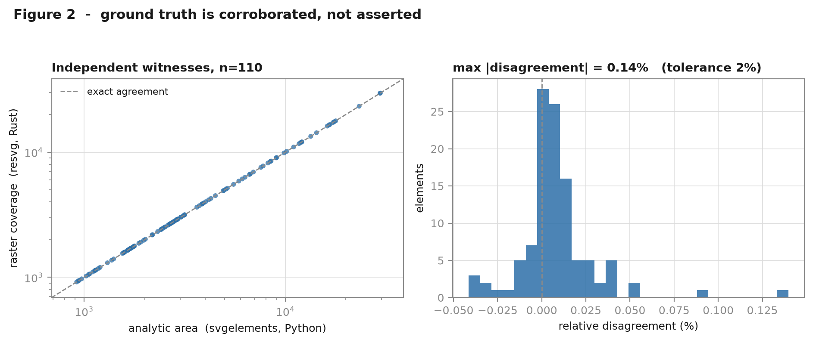
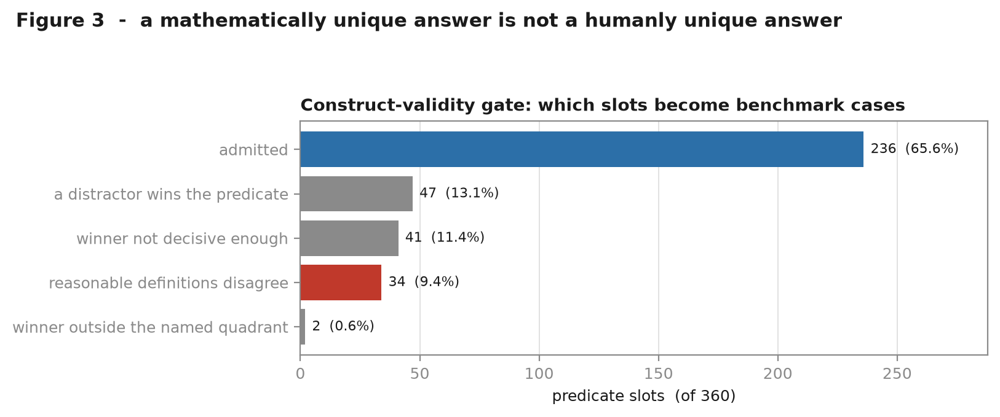

# svg-ambiguity-bench

### Can a small language model edit the shape you meant?

You ask for *"make the top-left shape blue"*. The model sees this:

```xml
<path id="e13415408" d="{{GEOM_1b7549de}}" fill="#8c5a3c"/>
<path id="e15485c60" d="{{GEOM_33cabe17}}" fill="#c0c0c0"/>
<path id="e0d63fea4" d="{{GEOM_c2532d12}}" fill="#8c5a3c"/>
<path id="e30176ca8" d="{{GEOM_a9f3024e}}" fill="#8c5a3c"/>
```

Three of those are the same shade. Nothing in the markup says which one is top-left. The
instruction refers to the *rendered picture*; the edit has to happen in the *source text*;
and the source text does not encode what the instruction is talking about.

So the model guesses, or it hedges and edits several. That is the phenomenon this
repository measures.


**The question it actually answers.** Supplying the missing facts obviously helps. But an
enriched prompt changes two things at once - it adds geometric information, *and* it adds
an enumerated list of elements the model can point at. Enumeration alone could move the
score with no geometry in it at all.

> **Does context augmentation help because of the information it supplies, or merely
> because of the format it arrives in?**

That is the contribution. Everything else in this repository exists to make that one
comparison trustworthy.

---

## This is a measurement instrument, not a task set

A benchmark says *"here are some tasks"*. An instrument says *"here is what I measure,
how it is calibrated, where it fails, and what you may conclude from a reading."* This
repository is built as the second thing, which is why it ships calibration data, a
register of failed assumptions, and a validity argument alongside the code.

| Document | What it holds |
|---|---|
| [`CLAIMS.md`](CLAIMS.md) | Every claim, and the gate: build nothing that does not strengthen one |
| [`EVIDENCE.md`](EVIDENCE.md) | Measured values per claim, regenerated rather than recalled |
| [`VALIDITY.md`](VALIDITY.md) | Internal, construct, external and statistical-conclusion validity in one place |
| [`FAILED_ASSUMPTIONS.md`](FAILED_ASSUMPTIONS.md) | Every time the project proved itself wrong, and what it would have cost |
| [`RESULTS.md`](RESULTS.md) | What may and may not change once model results exist, decided before any exist |
| [`docs/adr/`](docs/adr/) | Each non-obvious decision, its alternatives, and what was traded away |

Two figures that summarise the instrument's condition before any model has run:

**Ground truth is corroborated by two independent implementations**, not asserted by one.
Maximum disagreement between a Rust rasteriser and a Python path-algebra library across
110 elements is 0.14%, against a 2% tolerance; they agree on element *ranking* in 12/12
SVGs, which is what the ordinal instructions actually depend on.



**A mathematically unique answer is not a humanly unique answer.** A sample may host a
predicate only when every reasonable reading of the instruction picks the same element -
`leftmost` by centroid, by left edge, and by bounding-box midpoint; `top_left` by
Euclidean, Manhattan and nearest-corner distance. 9.4% of predicate slots are refused
because those readings disagree, despite being perfectly well measured.



---

## Result: a constrained null

Not *"context never helps"* — the more precise and harder-to-dismiss statement:

> **Under this instrument, for this model, on this corpus, context changed generation
> behaviour without changing reference identification.**

`qwen2.5-coder:3b`, 180 cases per arm, 30 clusters, cluster bootstrap over SVGs.

| arm | identification accuracy | `NO_EDIT` | malformed | abstained |
|---|---|---|---|---|
| `baseline` | **0.0444** [0.0167, 0.0778] | 0.444 | 0 | 0 |
| `permuted` | **0.0444** [0.0167, 0.0778] | 0.483 | 0 | 0 |
| `enhanced` | **0.0444** [0.0167, 0.0778] | 0.478 | 0 | 0 |

Random-selection reference **0.1852**. Every pairwise difference **+0.0000**.
**Minimum detectable effect 0.0289** — an improvement above ~3 points would have been
seen. (The p-values are 1.000 and carry no information: with a difference of exactly
zero, no permutation can be more extreme.)


**Why this is a result rather than a failed run.** Three hypotheses, all measured:

| | | |
|---|---|---|
| **H1** the model ignored the context | *rejected* | 56/180 responses differ |
| **H2** the context never reached the model | *rejected* | 180/180 prompts differ |
| **H3** context altered generation without improving reference resolution | **supported** | the only hypothesis consistent with both |

`permuted` and `enhanced` identified **exactly the same 8 cases** — shuffling the
geometry between elements changed nothing about which element was acted on.

**On the central claim.** C3 asks whether an improvement is information or format. The
treatment effect was zero, so there is no quantity to decompose: C3 is **not supported
because its prerequisite did not occur** — a scientific dependency, not a methodological
failure.

Full write-up: [`docs/04-results.md`](docs/04-results.md). Observation log:
[`OBSERVATIONS.md`](OBSERVATIONS.md). Numbers: `results/metrics.json`.

The design was frozen before any of this was observed — see
[`DESIGN_FREEZE.md`](DESIGN_FREEZE.md) and the `instrument-freeze-v1` tag.

---

## The claim structure (read this before the numbers exist)

The framing matters, so it is stated up front rather than discovered in the discussion section.

**The enhanced arm is the benchmark. The baseline arm is a manipulation check.**

The baseline arm has no dynamic range by construction: if the corpus is genuinely
underdetermined, *every* model scores at the random-selection floor of `1/K`, so the
baseline cannot discriminate between models. Its job is to demonstrate that the corpus
really is underdetermined — that the information was removed, not merely obscured. The
discriminative measurement lives in the enhanced arm, where a model that has the facts
must still resolve the reference correctly.

Stating it the other way round — "we prove models fail, then we fix them" — would be
close to tautological, because the treatment restores information the design deliberately
removed.

---

## What is being measured

**Corpus.** 20–30 generated SVGs. Each contains an *ambiguity set* of K ∈ [4,7] elements
sharing an identical tag and fill, with path data replaced by fixed-length opaque tokens so
position cannot be read off the source. All geometry lives inside `d` — no `transform`, no
`x`/`cx` — because a positional attribute would silently reintroduce the answer.

**Instructions.** Two families, each resolving to exactly one element under a
machine-checked ground truth:

- **Spatial** — `top_left`, `bottom_right`, `leftmost`, `topmost`, …
- **Ordinal size** — `largest`, `second_largest`, `third_largest`, `smallest`

**Arms.** One runner, one prompt template, one difference — an injected context block:

| Arm | Context supplied | Role |
|---|---|---|
| `baseline` | nothing | manipulation check: is the corpus really underdetermined? |
| `permuted` | correctly-formatted facts, **values shuffled between elements** | isolates *format* from *information* |
| `enhanced` | derived visual facts | the benchmark |
| `ceiling` | facts *plus* predicate labels | upper bound; excluded from headline |

The `permuted` arm is the one that decides whether the result means anything. An enumerated
list of elements gives a model referential handles it did not have before — that alone could
move the score with no geometric content whatsoever. Without a control that holds the format
fixed and destroys only the information, "supplying geometry helps" and "supplying a list
helps" are indistinguishable.

**Primary metric: identification accuracy** — did the model act on the intended element?
Reported separately from execution correctness and from collateral edits, because collapsing
those three into one number would attribute a formatting failure to a reasoning failure.
**Abstention is a distinct outcome, not a failure.** Declining to guess on a provably
underdetermined instruction is the epistemically correct response, and a metric that punishes
it would reward confident guessing while the project's own motivation is that models hedge.

---

## Reproducing the numbers

Four tiers, in increasing cost. **A reviewer can stop at Tier 1 and still have checked every
published number.**

| Tier | Verifies | Needs | Time |
|---|---|---|---|
| 1 | every reported number, from committed evaluation rows | Python | ~1 min |
| 2 | the whole scoring chain, from committed raw responses | Python | ~2 min |
| 3 | the corpus is a deterministic function of its seed | + renderer | ~10 min |
| 4 | the model results | + local model | hours |

Tiers 1 and 2 need no model and no GPU. Raw responses are committed, so a skeptical reviewer
can write their own scorer and check whether it reproduces our numbers — which is the
strongest verification this project can offer.

Tier 4 will *not* reproduce bit-for-bit. Small local models vary with backend build,
threading, and quantization even at temperature 0. What must reproduce is the conclusion:
aggregate rates within the reported interval. Claiming exact reproduction would be false.

Commands land as the steps that implement them land.

---

## Repository layout

```
docs/           specs, experiment design, ADRs, results write-up
configs/        experiment configs; every run is reproducible from one
src/svgbench/   the library
tests/          unit, property, integration, and audit suites
scripts/        thin CLI wrappers - no logic lives here
data/frozen/    the immutable corpus. Committed: it is the scientific record
experiments/    raw model responses + per-case evaluations. Committed
results/        computed metrics and figures. Committed
```

## Development

```bash
python -m pip install -e ".[dev]"
```

```bash
python -m pytest
```

Design rationale lives in [`docs/adr/`](docs/adr/) — one short record per non-obvious
decision, with the alternatives considered and what was traded away.

## Threats to validity

Split the way a paper would split it. The full argument - what is established, what is
planned, and what cannot be established at all - is in [`VALIDITY.md`](VALIDITY.md), with
the plain-language version in [`LIMITATIONS.md`](LIMITATIONS.md).

**Internal validity** — is the measured difference caused by the manipulated variable?
The dominant threat is that `enhanced` changes two things at once: it adds geometric facts
*and* an enumerated element list. The `permuted` arm holds format fixed and destroys only
the information. Arm comparability is machine-checked (shared corpus hash, identical
decoding), and the audit was verified to fail on planted drift.

**Construct validity** — does the metric measure the thing named? "Edit accuracy" conflates
identification, execution, and collateral damage, so a formatting failure would read as a
reasoning failure. Reporting is decomposed instead, and abstention is a distinct outcome
rather than a failure — otherwise the metric rewards confident guessing while the project's
own motivation is that models hedge.

**External validity** — the weakest axis, and deliberately so. The corpus is synthetic,
opaque geometry tokens do not occur in real SVGs, one small model is tested, and separability
margins make the corpus easier than arbitrary layouts. The `legible` arm narrows the
markup-realism gap; it does not close it. No generalization is claimed.

**Statistical conclusion validity** — instructions sharing an SVG are not independent, so
the effective sample size is ~30 clusters, not ~180 cases. Resampling and testing are at the
SVG level. Intervals will be wide, and this cannot be fixed within the assignment's corpus
budget — so the response is a narrower claim, with the minimum detectable effect reported
*before* results, so a null outcome is distinguishable from an underpowered one.

Every module maps to one claim in [`CLAIMS.md`](CLAIMS.md), which also records what would
falsify each claim and what this repository explicitly does not claim.

## License

MIT — see [`LICENSE`](LICENSE).
