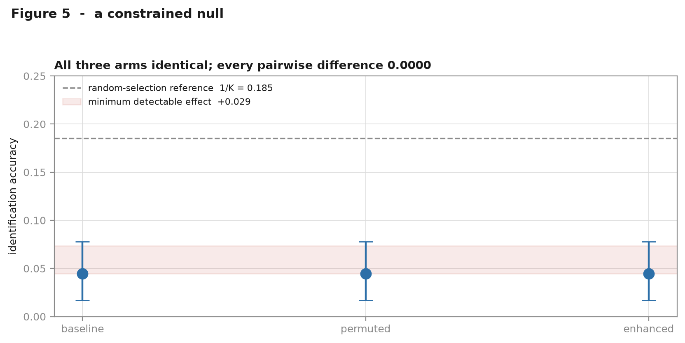

# Results

**A constrained null.** Not *"context never helps"*, but: **under this instrument, for
this model, on this corpus, context changed generation behaviour without changing
reference identification.**

Everything below was measured after the `instrument-freeze-v1` tag, against scoring
rules, predicates and a dataset fixed before any model output existed. Nothing in the
instrument was changed in response to any number ([`RESULTS.md`](../RESULTS.md)).

---

## 1. Headline

`qwen2.5-coder:3b`, greedy decoding, one replicate, 180 cases per arm, 30 clusters.
Cluster bootstrap over SVGs, 95% interval.

| arm | identification accuracy | strict | collateral | `NO_EDIT` | malformed | abstained |
|---|---|---|---|---|---|---|
| `baseline` | **0.0444** [0.0167, 0.0778] | 0.0222 | 0.533 | 0.444 | 0 | 0 |
| `permuted` | **0.0444** [0.0167, 0.0778] | 0.0389 | 0.478 | 0.483 | 0 | 0 |
| `enhanced` | **0.0444** [0.0167, 0.0778] | 0.0389 | 0.483 | 0.478 | 0 | 0 |

Random-selection reference: **0.1852**.

| comparison | difference | interpretation |
|---|---|---|
| `enhanced` − `baseline` | **+0.0000** | the treatment had no effect |
| `enhanced` − `permuted` | **+0.0000** | nothing to attribute to information vs format |
| `permuted` − `baseline` | **+0.0000** | format alone had no effect either |

**Minimum detectable effect: 0.0289.** An improvement larger than about 3 percentage
points would have been detected. None was.

> The p-values are all 1.000 and should be **ignored**. With an observed difference of
> exactly zero, no permutation can be more extreme, so the test is degenerate. The
> minimum detectable effect is what bounds this result; the p-value carries no
> information here.



---

## 2. Where the causal chain breaks


Each link is measured, not assumed:

| link | evidence | verdict |
|---|---|---|
| context → prompt | 180/180 prompts differ between every arm pair | **changed** |
| prompt → model output | 56/180 responses differ, `baseline` vs `enhanced` | **changed** |
| model output → identification | 0.0444 in all three arms | **unchanged** |

`enhanced` and `permuted` prompts are token-identical (median 817 tokens against 535 for
`baseline`), so the format match is exact rather than approximate.

---

## 3. Discussion: three hypotheses

**H1 — the model ignored the context.** *Rejected.* Responses differ in 56/180 cases
between `baseline` and `enhanced`, and in 27/180 between `enhanced` and `permuted`. The
context demonstrably alters generation.

**H2 — the context never reached the model.** *Rejected.* Prompts differ in 180/180
cases between every arm pair, and a manual inspection of a rendered prompt confirms the
geometry table is present, correctly formatted, and numerically correct against ground
truth.

**H3 — the context altered generation without improving reference resolution.**
*Supported.* This is the only hypothesis consistent with all three measurements
simultaneously, and it is a more specific statement than "no improvement".

`permuted` and `enhanced` identified **exactly the same eight cases**. Shuffling the
geometric values between elements changed nothing about which element the model acted on.
A model consuming the numeric content should have been *harmed* by permutation; it was
not.

---

## 4. Why baseline sits below chance

Baseline identification is 0.0444 against a 0.1852 reference — roughly four times below,
not at, chance. That decomposes cleanly and is not evidence of an instrument fault:

| | |
|---|---|
| cases where the model changed nothing | **80/180** |
| of elements it did touch, share that were distractors | **39.3%** |
| identification **given** it touched a candidate | **8/65 = 0.123** |

The `1/K` reference assumes a model that both acts and confines itself to the candidate
set. This model frequently does neither. Restricted to cases where it picked a candidate,
0.123 against 0.185 is about 1.3 SE below — indistinguishable from guessing.

**C1 holds; there is no leakage.** Corpus target positions test as uniform-within-K
(χ² = 9.14, 6 df, **p = 0.17**) using a distribution sealed at freeze time, so no
positional policy could beat chance regardless of model behaviour.

---

## 5. Claim outcomes

| claim | outcome |
|---|---|
| **C1** corpus genuinely under-determined | **Supported.** Baseline at/below chance, no positional leak |
| **C2** arms comparable | **Held.** Shared corpus hash, token-matched prompts, identical decoding |
| **C3** improvement is information, not format | **Not supported — prerequisite not met.** The treatment effect was zero, so there is no quantity to decompose |
| **C4** identification separable from execution | **Vacuous.** Execution given identification = 1.000 in every arm |
| **C5** abstention measured, not punished | **Vacuous.** 0 abstentions in every arm |
| **C6** numbers independently verifiable | **Held.** Responses and evaluations committed; Tier 1–2 need no model |
| **C7** ground truth correct | **Held.** Two engines agreed on ranking 30/30 |
| **C8** ground truth matches human judgement | **Held.** 9.4% of predicate slots refused for definition disagreement |

On **C3**: *not supported* rather than *untestable*. The experiment did test the
treatment; the treatment effect was zero. C3 is conditional on a non-zero effect, and
that condition was measured and not met. This is a scientific dependency, not a
methodological failure.

On **C4** and **C5**: both turned out vacuous, under exactly the conditions their own
falsification criteria named before any data existed. The decomposition was still correct
to build — it *could* have mattered and would have been unrecoverable afterwards — but on
this data it separated nothing. The model never says it cannot tell; it returns the
document unchanged, which the frozen rules score `NO_EDIT`.

---

## 6. What this does not show

- **Not that context augmentation is useless.** One model, one corpus, one context
  format. A larger model, or a different rendering of the same facts, could behave
  differently.
- **Not that the model cannot use geometry.** It may be blocked downstream by the edit
  mechanics rather than by reference resolution. Distinguishing those requires an arm
  that names the target element outright — which is **not** in the pre-registered design
  and was deliberately not added after seeing the result.
- **Not a statement about real SVG editing.** Opaque `{{GEOM_…}}` tokens do not occur in
  the wild.

The full treatment is in [`../LIMITATIONS.md`](../LIMITATIONS.md) and
[`../VALIDITY.md`](../VALIDITY.md).

---

## 7. Reproducing these numbers

```bash
python -m svgbench.cli evaluate     # rescore committed responses; no model, no renderer
```

Raw responses (`experiments/*/responses.jsonl`) and scored rows
(`experiments/*/evaluations.jsonl`) are committed. A sceptical reader can write their own
scorer and check it against ours — which is the strongest verification this project can
offer.
